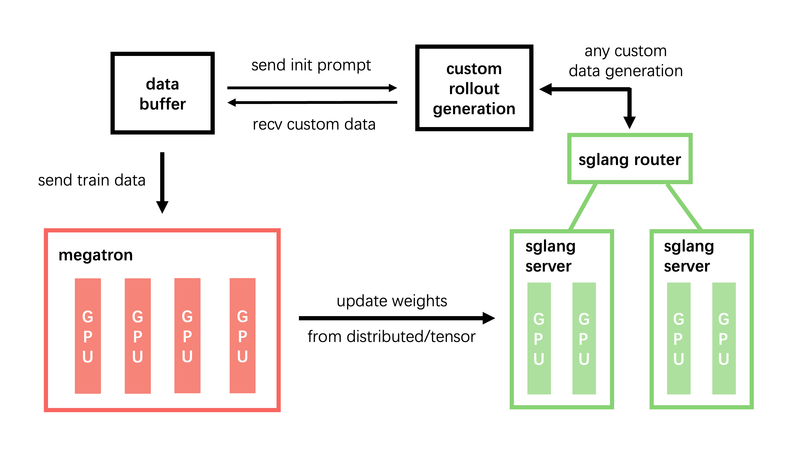

# slime

[中文版](./README_zh.md)

[](https://deepwiki.com/THUDM/slime)

**slime** is an LLM post-training framework for RL scaling, providing two core capabilities:

1.  **High-Performance Training**: Supports efficient training in various modes by connecting Megatron with SGLang;
2.  **Flexible Data Generation**: Enables arbitrary training data generation workflows through custom data generation interfaces and server-based engines.

## Blogs

- Our vision: [slime: An SGLang-Native Post-Training Framework for RL Scaling](https://lmsys.org/blog/2025-07-09-slime/).
- Our ideas on agentic training: [Agent-Oriented Design: An Asynchronous and Decoupled Framework for Agentic RL](https://www.notion.so/Agent-Oriented-Design-An-Asynchronous-and-Decoupled-Framework-for-Agentic-RL-2278e692d081802cbdd5d37cef76a547).
- slime has served as the RL framework for GLM-4.5: [GLM-4.5: Reasoning, Coding, and Agentic Abililties](https://z.ai/blog/glm-4.5)

## Table of Contents

  - [Architecture Overview](#architecture-overview)
  - [Quick Start](#quick-start)
  - [Checkpoint Format Conversion](#checkpoint-format-conversion)
  - [Starting the Training Process](#starting-the-training-process)
  - [Argument Descriptions](#argument-descriptions)
  - [Developer Guide](#developer-guide)
  - [FAQ & Acknowledgements](#faq--acknowledgements)

## Architecture Overview



**Module Descriptions**:

  - **training (Megatron)**: Responsible for the main training process, reads data from the Data Buffer, and synchronizes parameters to the rollout module after training.
  - **rollout (SGLang + router)**: Generates new data (including rewards/verifier outputs) and stores it in the Data Buffer.
  - **data buffer**: A bridge module that manages prompt initialization, custom data, and rollout generation methods.

## Quick Start

For a comprehensive quick start guide covering environment setup, data preparation, training startup, and key code analysis, please refer to:
- [Quick Start Guide](./docs/en/quick_start.md)

We also provides examples for some usecases not covered in the quick start guide, please check [examples](examples/).

## Arguments Walk Through

Arguments in slime are divided into three categories:

1.  **Megatron arguments**: slime reads all arguments set in Megatron via `PYTHONPATH`. You can configure Megatron by passing arguments like `--tensor-model-parallel-size 2`.
2.  **SGLang arguments**: All arguments for the installed SGLang are supported. These arguments must be prefixed with `--sglang-`. For example, `--mem-fraction-static` should be passed as `--sglang-mem-fraction-static`.
3.  **slime-specific arguments**: Please refer to: [slime/utils/arguments.py](slime/utils/arguments.py)

For complete usage instructions, please refer to the [Usage Documentation](docs/en/usage.md).

## Developer Guide

  - **Contributions are welcome\!** If you have suggestions for new features, performance tuning, or feedback on user experience, feel free to submit an Issue or PR 😊

  - Use [pre-commit](https://pre-commit.com/) to ensure code style consistency for your commits:

    ```bash
    apt install pre-commit -y
    pre-commit install
    ```

  - For debugging tips, please refer to the [Debugging Guide](docs/en/debug.md)

## FAQ & Acknowledgements

  - For frequently asked questions, please see the [Q\&A](docs/en/qa.md)
  - Special thanks to the following projects & communities: SGLang, Megatron‑LM, mbridge, OpenRLHF, veRL, Pai-Megatron-Patch and others.
